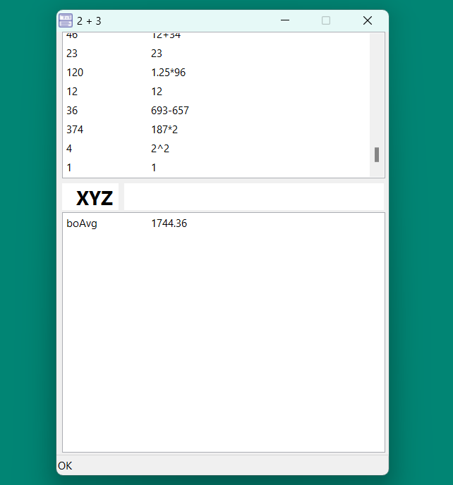

# 2 + 3 — A Calculator

## Short Description
**2 + 3** is a lightweight, system-tray calculator with persistent history and variable support.
It allows quick expression evaluation, variable management, and fast access via a global hotkey (**Alt+K**).

## Platform Support
Currently, **2 + 3** is designed for Windows only.
It relies on Windows-specific system tray and global hotkey functionality.

## Installation
1. Download the latest release from the [Releases](../../releases) page.
3. Run the executable `calc2plus3.exe`.

## Installation from Sources
1. Make sure you have Free Pascal Compiler (FPC) ≥ 3.2.2 and Lazarus IDE ≥ 4.0 installed.
2. Clone the repository:
   ```bash
   git clone https://github.com/vf58bwk4/calc2plus3.git
   cd calc2plus3
   ```

### Option 1: Using Lazarus IDE
3. Open `src/calc2plus3.lpi` in Lazarus IDE.
4. Build the project (`Run → Build`).

### Option 2: Using lazbuild (Command Line)

3. Make sure you have Free Pascal Compiler (FPC) Lazarus IDE accessible via %PATH% variable.
4. Build the project using:

   ```bash
   lazbuild src/calc2plus3.lpi
   ```

The executable will be created in `build` directory.

## How to Use the Program


The program window is divided into four panels:
- **History**
- **Variable Name**
- **Expression**
- **Variable List**

### Expressions
- Calculations are performed in the **Expression** panel.
- You can use numbers, operators `+ - * / ^ ( )`, and variable names.
- Press **Enter** to evaluate the expression.

### History
- All calculations are stored in the **History** panel.
- The **right column** contains the expression, and the **left column** contains the result.
- To insert a history's result or expression into the **Expression** panel:
  - Double-click the result or expression.
  - If **Ctrl** is held, the **Expression** panel will be replaced with the selected value.

### Variables
- To create or update a variable:
  - Press **Ctrl+Enter** while in either the **Expression** or **Variable Name** panel.
  - The expression will be evaluated, and the variable will be created or updated.
- To add or subtract a calculation result directly to/from an existing variable:
  - Use **Ctrl++** (add) or **Ctrl+-** (subtract).
- Variable operations (create, update, add, subtract) are not saved in the history.
- To insert a variable’s name or value into the **Expression** panel:
  - Double-click the variable name or value.
  - If **Ctrl** is held, the **Expression** panel will be replaced with the selected value.
- To delete a variable:
  - Hold **Ctrl+Alt** and double-click its name or value.
- To move a variable name into the **Variable Name** panel:
  - Hold **Shift** and double-click the variable name.

## Persistence and Accessibility

### Data Storage
- History and variables are stored in:
    - %APPDATA%\2plus3\history.2p3
    - %APPDATA%\2plus3\variables.2p3

### Tray and Hotkey
- Closing the program window hides it in the **System Tray**.
- To fully exit, use the **Tray icon context menu**.
- A system hotkey (**Alt+K**) is used to show or hide the program.

---

## License
This project is licensed under the [MIT License](./LICENSE).
