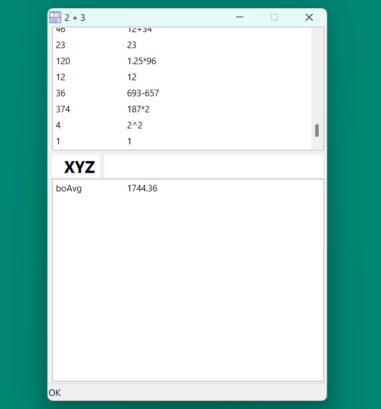

# 2 + 3 — A Calculator

**2 + 3** is a lightweight system-tray calculator for Windows with persistent history and variables,
always one hotkey (**Alt+K**) away.

## Installation
1. Download `calc2plus3.exe` from the [Releases](../../releases) page.
2. Run it. There is no installer: the program is a single executable.

## Installation from Sources
Requires Free Pascal Compiler (FPC) ≥ 3.2.2 and Lazarus ≥ 4.0.

1. Clone the repository:
   ```powershell
   git clone https://github.com/vf58bwk4/calc2plus3.git
   cd calc2plus3
   ```
2. Build the project, either:
   - in Lazarus IDE: open `src\calc2plus3.lpi` and select **Run → Build**, or
   - from the command line (`lazbuild` must be in `PATH`):
     ```powershell
     lazbuild src\calc2plus3.lpi
     ```

The executable is created as `build\calc2plus3.exe`.

## How to Use the Program


The window has four panels: **History**, **Variable Name**, **Expression** and **Variable List**.
Type an expression and press **Enter**: the result is added to **History**.

### Expressions
- Numbers, variable names, operators `+ - * / ^ ( )` and math functions such as `sqrt`, `sin`, `ln`.
- Numbers use the Windows decimal separator, and function arguments are separated by the Windows list separator.
  A change of Windows regional settings takes effect after a restart.
- Pasted numbers are converted to the local format, with digit grouping removed:
  e.g. `1.234.567,89` is pasted as `1234567.89` on an English system.

### Keys and Mouse
| Where | Keys / mouse | Action |
|---|---|---|
| Expression | **Enter** | Evaluate and add to History |
| Expression, Variable Name | **Ctrl+Enter** | Evaluate and store in the variable named in Variable Name |
| Expression, Variable Name | **Ctrl++** / **Ctrl+-** | Add the result to / subtract it from that variable |
| Expression | **Ctrl+Z** / **Ctrl+Y** | Undo / redo |
| Expression | **Ctrl+Backspace** | Delete the word to the left |
| Variable Name | **Ctrl+Backspace** | Clear the name |
| Expression | **Esc** | Select all, then clear, then hide the window |
| History, Variable List | **Enter** or double-click | Insert the value into Expression |
| History, Variable List | **Ctrl+Enter** or **Ctrl**+double-click | Replace Expression with the value |
| History, Variable List | **Ctrl+Alt**+double-click | Delete the entry |
| Variable List | **Shift+Enter** or **Shift**+double-click on a name | Copy the name into Variable Name |
| Anywhere in Windows | **Alt+K** | Show or hide the window |

Variable operations are not added to History.

## Tray, Startup and Autorun
- Closing the window hides it in the system tray. Left-click the tray icon or press **Alt+K** to show it.
- To exit, select **Close** in the tray icon menu.
- The first start is hidden; later the window starts shown or hidden, as it was last left.
- While running, the program registers itself to start with Windows
  (`HKCU\Software\Microsoft\Windows\CurrentVersion\Run`); exiting from the tray menu removes this.
- Only one instance runs at a time.

## Data Storage
All data is kept in `%APPDATA%\calc2plus3`:
- `history.2p3`, `variables.2p3` — history and variables
- `workspace.2p3` — contents of Expression and Variable Name
- `winpos.2p3` — window position and visibility
- `calc2plus3.log` — error log

To uninstall, exit the program and delete `calc2plus3.exe` and this folder.

## License
This project is licensed under the [MIT License](./LICENSE).
